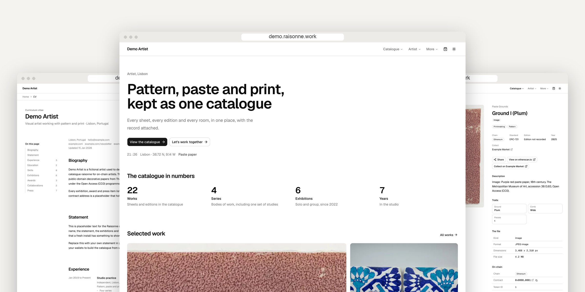
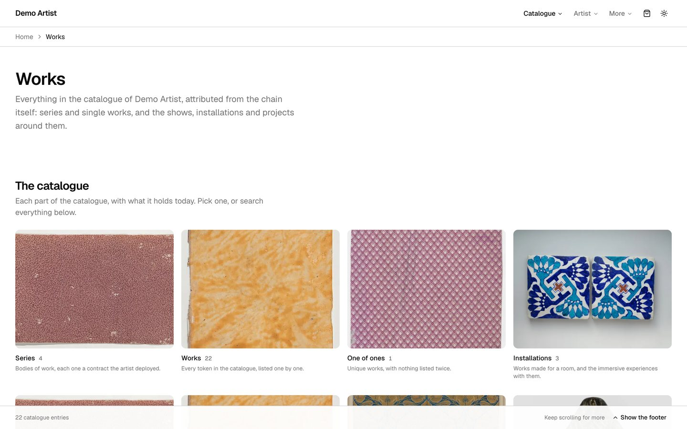
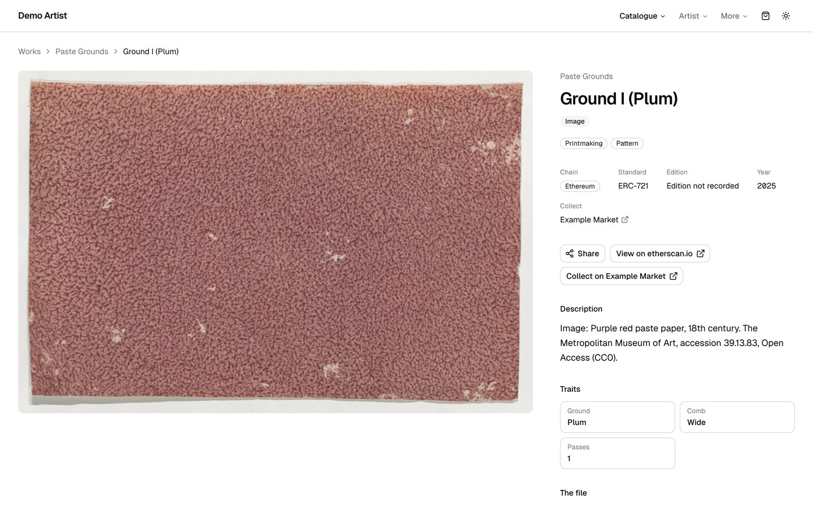
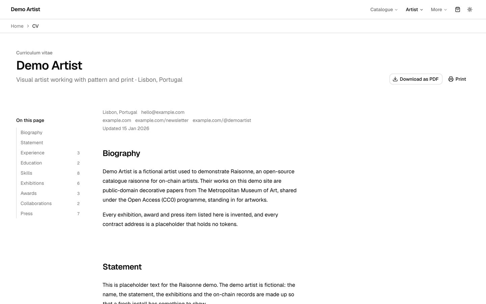
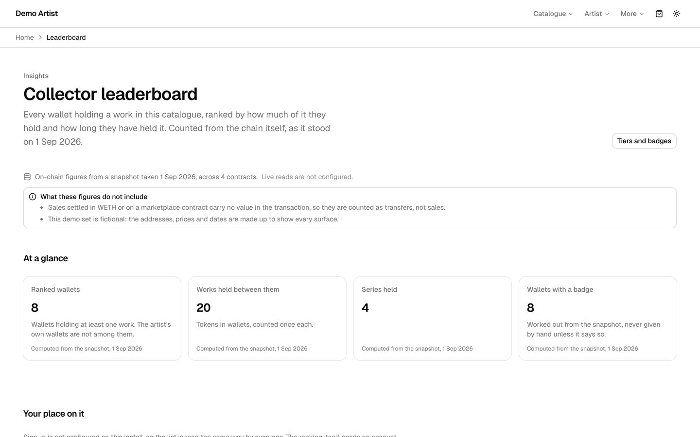
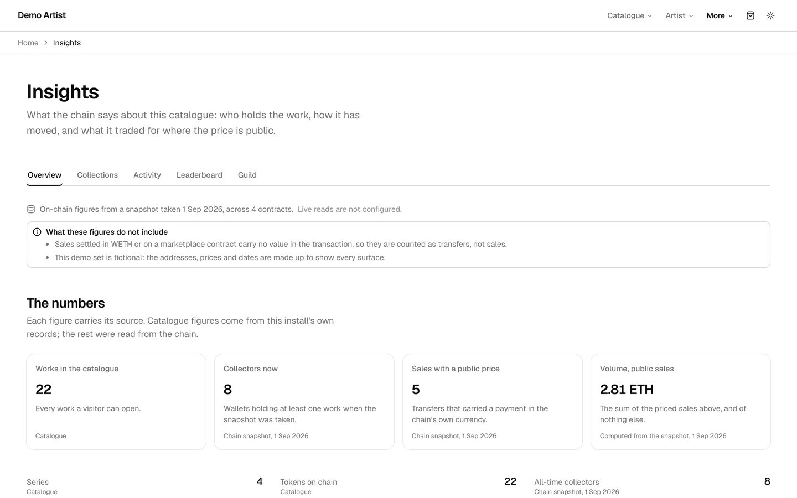
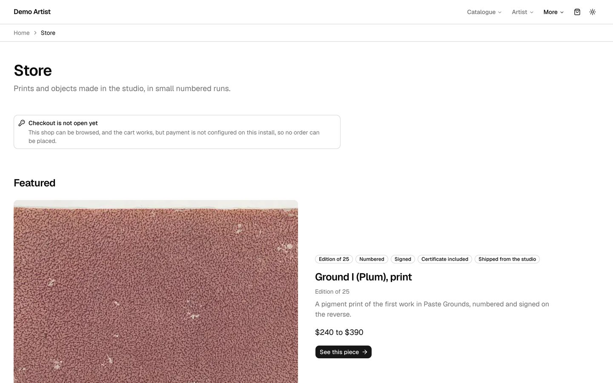

<p align="center">
  
</p>

<h1 align="center">Raisonné</h1>

<p align="center">
  <strong>An open-source catalogue raisonné for artists who work on-chain.</strong><br>
  Every series and every work, with the on-chain record behind it, on a site you own and host.
</p>

<p align="center">
  <a href="https://demo.raisonne.work"><strong>Live demo</strong></a> ·
  <a href="https://demo.raisonne.work/docs">Docs</a> ·
  <a href="https://orkhan.design/open/raisonne">Build guide</a> ·
  <a href="https://raisonne.work">Hosted version (coming soon)</a>
</p>

<p align="center">
  <a href="LICENSE"></a>
  <a href="https://github.com/orkhan-art-web/raisonne-os/releases"></a>
  
  
  
</p>

---

A catalogue raisonné is the complete record of an artist's work. It is usually compiled late in a career, often by someone else. For an artist who mints on-chain, the record already exists: it is just scattered across contracts, marketplaces and wallets.

Raisonné gathers it into one site. It shows every series and work, explains why each one is attributed to the artist, and keeps the CV, the exhibitions and the press around the work. One artist per install, data as files, no required database, and every optional module switched off until you configure it.

```bash
git clone https://github.com/orkhan-art-web/raisonne-os.git
cd raisonne-os
pnpm install
pnpm dev    # http://localhost:3000, showing the Demo Artist
```

## Contents

- [What you get](#what-you-get)
- [Screens](#screens)
- [Make it yours](#make-it-yours)
- [Principles](#principles)
- [Don't want to run a server?](#dont-want-to-run-a-server)
- [Reference](#reference): [the data](#the-data), [images](#images), [settings](#settings), [accounts, collectors and the store](#accounts-collectors-and-the-store), [pages](#pages), [updating](#updating-raisonné), [search engines and the API](#search-engines-sharing-and-the-public-api), [design](#design)
- [Contributing, security and licence](#contributing)

## What you get

| | |
| --- | --- |
| **The catalogue** | Every series and one of one, filtered by chain and kind. Ethereum and Base are read from the chain; Bitcoin Ordinals can be shown from your own records. |
| **Proof on every series** | Why each series is attributed to you, in plain words with the raw detail: deployer, ownership log, `owner()`, token creator, minted to. Each one links to the block explorer. It is attribution evidence, not a holder-by-holder history. |
| **A CV that prints** | Biography, statement, exhibitions, awards and press. The page prints clean and `/cv/download` builds a paginated PDF. |
| **Collectors** | Wallet sign-in with SIWE, no email and no password. A collector is an address. The leaderboard is computed from a chain snapshot, with tiers and badges you define. |
| **Insights** | Holders, transfers, sales and volume from the same snapshot, with its gaps stated rather than hidden. |
| **A store** | Stripe Checkout, with every price computed on the server. Orders are JSON files you own. Print on demand is a stub in this release. |
| **Found and shared** | Sitemap, robots, structured data, share cards and a read-only catalogue API, all generated from your own data. |
| **Keeps itself current** | `/update` and `pnpm update:raisonne` pull new releases without touching your data. |

Nothing is configured by default, and that is a working state. A page whose module is missing a key shows a panel naming the exact variable it needs. It never shows a made-up number.

## Screens

All from the [live demo](https://demo.raisonne.work): a fictional artist, with public-domain images from The Met's Open Access programme (CC0).

<table>
  <tr>
    <td width="50%"><br><sub><strong>The catalogue.</strong> Series, works, one of ones and installations.</sub></td>
    <td width="50%"><br><sub><strong>A work.</strong> The media large, the record, the provenance.</sub></td>
  </tr>
  <tr>
    <td width="50%"><br><sub><strong>The CV.</strong> Prints as a clean PDF.</sub></td>
    <td width="50%"><br><sub><strong>Collectors.</strong> Ranked from a chain snapshot, with what the figures leave out.</sub></td>
  </tr>
  <tr>
    <td width="50%"><br><sub><strong>Insights.</strong> Every figure carries its source.</sub></td>
    <td width="50%"><br><sub><strong>The store.</strong> Prints and objects, paid into your own Stripe.</sub></td>
  </tr>
</table>

## Make it yours

A fresh clone renders the Demo Artist from `src/fixtures/demo.json`. Your own data lives in `src/fixtures/local/`, which is gitignored, so it never reaches the public repository.

**1. Your catalogue.** Write `src/fixtures/local/site.json` in the shape of `SiteData` (`src/lib/types.ts`). If you already run a CMS that exposes a read-only `/api/proxy` (the orkhan.art stack does), fill it from there:

```bash
RAISONNE_CMS_URL=https://your.site pnpm snapshot
```

**2. Your collectors and insights.** Read holders and transfers from the chain with a free Alchemy key:

```bash
ALCHEMY_API_KEY=... pnpm snapshot:chain
```

**3. Your settings.** Copy `.env.example` to `.env.local`. Every variable is documented there and in [Settings](#settings).

**4. Run it anywhere Node runs.** Node 20 or newer and pnpm:

```bash
pnpm build && pnpm start
```

The public [docs](https://demo.raisonne.work/docs) walk through the import, series and every feature from A to Z, and the [build guide](https://orkhan.design/open/raisonne) tells the story of building one. Agents working on this repository should read [CLAUDE.md](CLAUDE.md).

## Principles

- **One artist per install.** No multi-tenancy, no control plane.
- **Data is files.** A database is optional, never required.
- **Honest by default.** A missing key shows what is missing. A truncated history says it is truncated.
- **Nothing personal in the catalogue.** Collectors are addresses. Orders stay out of the fixtures, the snapshot and the public API.
- **No trackers.** Analytics are off until you choose Plausible, Umami or GA4.
- **Standard parts.** Stock shadcn/ui, so anyone can read and restyle it.
- **We never take a cut.** Checkout runs on your own Stripe account.

## Don't want to run a server?

[raisonne.work](https://raisonne.work) will host Raisonné for you. You pay once for a design, made by hand and released as a 1/1 or an edition, and it arrives in your wallet as a token you can keep, sell or trade with another artist. It is not open yet; leave your email there to hear first.

The app stays open source either way. The designs are what raisonne.work sells.

---

## Reference

### The data

`src/fixtures` holds everything the site renders.

| File | What it is |
| --- | --- |
| `src/fixtures/demo.json` | A fictional "Demo Artist" with public-domain images from The Met. A fresh clone renders this, and the footer says "Demo data". |
| `src/fixtures/local/site.json` | The artist's own data, in the shape of `SiteData` (`src/lib/types.ts`). Gitignored, so it never ships in the public repository. When this file exists it replaces the demo. |
| `src/fixtures/demo-import.ndjson` | A short recorded import run for the demo artist. |
| `src/fixtures/local/import-events.ndjson` | The artist's own recorded import run, if they have one. Gitignored. |
| `src/fixtures/local/snapshot-report.json` | What the last `pnpm snapshot` read, skipped and could not match. Gitignored. |
| `src/fixtures/local/chain.json` | The on-chain snapshot: holders, events, the leaderboard and the insights, written by `pnpm snapshot:chain`. Gitignored. |
| `src/fixtures/local/guild.json` | Tiers and badges, if the artist keeps any. Gitignored. |
| `src/fixtures/local/store.json` | Products, variants, categories, collections and shipping methods. Gitignored. |

The last three are read ahead of the matching key inside `site.json`, so an install can keep them in one file or four. `demo.json` carries a small set of all three, so a fresh clone can see every surface.

`src/fixtures/index.ts` is the only place that reads these files. Pages call `getSiteData()`; components only ever take the types in `src/lib/types.ts`, so the source can become a CMS or a live importer without touching the design.

Editing a fixture takes effect on the next request: the loader re-reads a file when its modification time changes.

#### Building `local/site.json` from an existing site

```bash
RAISONNE_CMS_URL=https://x.art pnpm snapshot   # reads that install's /api/proxy
pnpm snapshot -- --base=https://x.art          # the same, as an argument
pnpm snapshot -- --max-works=200               # a fast run while developing
pnpm snapshot -- --skip=works,press            # leave those alone
```

The same run also writes `local/guild.json` and `local/store.json` when the CMS has tiers, badges or products. It never reads a collector, a customer, an order, a commission or a provider key: those are personal data or secrets, and Raisonné derives a collector from the chain instead.

`scripts/snapshot-cms.ts` only sends GET requests, only writes inside `src/fixtures/local`, and merges onto what is already there: the on-chain importer stays the source of truth, so chain, contract, token id and the attribution evidence are never overwritten. It copies no keys, no admin addresses, no collector data and no contact addresses (see `INCLUDE_CONTACT` at the top of the file), and it writes `snapshot-report.json` next to the fixture with everything it skipped and why.

#### Building `local/chain.json` from the chain

```bash
ALCHEMY_API_KEY=... pnpm snapshot:chain
pnpm snapshot:chain -- --max-events=2000       # a fast run while developing
pnpm snapshot:chain -- --series=paste-grounds  # one contract only
pnpm snapshot:chain -- --skip-events           # holders only, no history
pnpm snapshot:chain -- --ens=50                # look up names for the top 50 wallets
pnpm snapshot:chain -- --dry-run               # print the counts, write nothing
```

It reads public data only: the holders of each contract in the catalogue, the tokens each one holds, and the ERC-721 and ERC-1155 transfers. A wallet address is public; nothing attached to one in a CMS is, and none of that is copied. The leaderboard and the insights are computed by `src/lib/chain/derive.ts`, the same module the running app uses, so a snapshot and a live read cannot disagree.

Two things the snapshot is honest about, because a catalogue raisonné that invents a number is not one. A contract whose history is longer than `--max-events` is written with `truncated: true`, and every page that reads it is expected to say so. And a sale settled in WETH or through a marketplace contract carries no value in the transaction itself, so it is counted as a transfer rather than as a sale at a price of zero. Both appear in `insights.gaps`, ready to print.

### Images

`next/image` only loads from hosts that `next.config.ts` allows, and those hosts are read from the fixtures at start up: every still, cover and portrait in `demo.json` and `local/site.json`, plus the thumbnails in the recorded import runs. Nothing is hardcoded to one artist.

If an image lives somewhere the data does not mention yet, add its host:

```bash
RAISONNE_IMAGE_HOSTS=arweave.net,i.seadn.io pnpm dev
```

Restart after changing the data's hosts, because the config is read once at start up.

One host is worth knowing about. Stills pinned on IPFS are served through a public gateway, so the allow-list carries `ipfs.io/ipfs/**`, and a path of `/ipfs/**` scopes nothing: every file on IPFS is reachable through it. The same is true of a marketplace CDN such as `nft2-cdn.alchemy.com`. That makes `/_next/image` on this install an uncapped image proxy and resizer for anything addressed through those hosts. It is the price of showing work whose media the artist does not host, and it is fine on a private or low-traffic install. If that matters on yours, pin the CIDs the catalogue actually uses and serve them from your own origin, then take the gateway out of the data.

### Settings

| Variable | What it does |
| --- | --- |
| `RAISONNE_TOOLS` | `1` serves the artist's workbench: `/import` and `/design-system`. They are on in development and off in production unless this is set; `0` switches them off everywhere. When they are off, those routes answer 404. Their pages are prerendered, so set it for the build as well: `RAISONNE_TOOLS=1 pnpm build && RAISONNE_TOOLS=1 pnpm start`. **Setting this on a public host publishes the workbench URLs to anyone who types them.** There is no password in front of them: `/import` replays your wallets and labels contracts "probably not yours", and `/design-system` is component documentation. Switch it off again when the import is done. **`/docs` is always public**: it is the how-to for building your own install. |
| `RAISONNE_TOOLS_NAV` | Legacy. No longer read. Tool links appear in the footer for an owner session only. |
| `RAISONNE_FIXTURES` | `demo` serves the demo artist even on an install that has its own `src/fixtures/local/site.json`, so you can see what a fresh clone shows without moving any files. Unset, the install's own data wins. |
| `RAISONNE_IMAGE_HOSTS` | Extra image hosts, comma separated. |
| `RAISONNE_SITE_URL` | The site's public address. Canonical URLs, the sitemap, robots.txt, structured data and share cards all start here. It overrides `settings.siteUrl` in the data, so a staging copy never advertises the live address. |
| `RAISONNE_NEWSLETTER_URL` | Where a newsletter sign-up is forwarded (`POST {email, source}`). Without it the form is not rendered anywhere and `/api/newsletter` answers 503: a sign-up box that drops addresses is worse than no box. |
| `RAISONNE_MAINTENANCE` | `1` closes the site, `0` keeps it open whatever the data says. Unset, `settings.maintenance.enabled` decides. Like `RAISONNE_TOOLS`, set it for the build as well as the server. |
| `RAISONNE_ANALYTICS_HOST` | The address of a self-hosted Plausible or Umami, when `settings.analytics` names one of those. |
| `RAISONNE_TRUSTED_PROXY` | `1` when a reverse proxy you control sets `X-Forwarded-For`. The newsletter rate limit then counts per client address. Without it the header is ignored, because a client can write anything it likes there, and the limit counts every direct request in one bucket. |

The rest is data, in `settings` (see `SiteSettings` in `src/lib/types.ts`): `siteUrl`, the module switches, `analytics`, `maintenance`, `allowAiCrawlers`, `redirects` and `legal`.

`.env.example` lists every variable, including the ones below. Copy it to `.env.local`, which is gitignored. Never put a key in the data.

### Accounts, collectors and the store

Three surfaces switch on with the `collectors`, `insights` and `store` modules in `settings.modules`, and each needs something from the environment before it can do anything true. **Nothing is configured by default, and that is a working state**: the catalogue keeps working, and every one of these pages renders a designed panel naming the exact variable that is missing rather than failing or, worse, showing a made-up number.

| Variable | What it does |
| --- | --- |
| `RAISONNE_SESSION_SECRET` | Signs the session cookie. At least 32 characters; `openssl rand -base64 32`. Without it nobody can sign in. |
| `RAISONNE_OWNER_ADDRESSES` | The wallets that own this install, comma separated. Signing in with one opens the artist-only pages. Unset, the minting wallets in the catalogue data are used, because on a one-artist install those are the artist. Set it when a minting key is cold, shared, or older than you would like to bet an admin page on. |
| `RAISONNE_SIWE_DOMAIN` | The domain a sign-in message is bound to. Defaults to the host of `RAISONNE_SITE_URL`, then to the request's own host. |
| `RAISONNE_SESSION_TTL_MINUTES` | Session lifetime. Default 60, maximum 1440. The cookie rotates while somebody is using the site. |
| `ALCHEMY_API_KEY` | Read-only chain access: holdings, holders, transfer events, and the contract call that lets a smart-contract wallet sign in. A free key covers an artist-sized catalogue. |
| `RAISONNE_CHAIN_NETWORKS` | Which Alchemy networks to read. Unset, the chains the catalogue uses. |
| `RAISONNE_CHAIN_CACHE_SECONDS` | How long a holdings read is held in memory. Default 300. |
| `STRIPE_SECRET_KEY` | Checkout. Test keys are the only ones this theme has been exercised with. |
| `STRIPE_WEBHOOK_SECRET` | The webhook signing secret. Without it the webhook refuses every request, because an unverified webhook is a public button marked "mark this order paid". |
| `RAISONNE_ORDERS_DIR` | Where the JSON order store writes. Default `.data/orders`. Put it on a disk that survives a deploy. |
| `RAISONNE_STORE_CURRENCY` | The currency `pnpm snapshot` reads CMS prices as. Default USD. |
| `RAISONNE_POD_PROVIDER`, `RAISONNE_POD_API_KEY` | Print on demand. Dispatch is a stub in this release: the flow and the pages are built, the call to Prodigi, Printful or Gelato is not. |

#### How it fits together

- **Sign-in is in the app.** SIWE (EIP-4361) with viem: the server issues a nonce, composes the message, and destroys the nonce on use. The session is an httpOnly, SameSite=Lax, signed cookie that carries its own expiry, so there is no session table. Smart-contract wallets (ERC-1271, and ERC-6492 for one not deployed yet) work when `ALCHEMY_API_KEY` is set; without it, only a key-pair wallet can sign in, and the page says so. There is no email, no password and no third-party auth service.
- **A collector is an address.** Holdings are read from the chain for the signed-in wallet, cached in memory for a few minutes, with a re-sync button that clears that cache. Nothing about a person is stored: no name, no email, no profile. What the leaderboard and the insights show is computed from `local/chain.json`, never live, because that would mean reading every contract's whole history on a page load.
- **The store owns no prices in the browser.** The cart in local storage holds slugs, variant ids and quantities. Every figure a visitor sees, and every figure that reaches Stripe, is computed on the server by `priceCart()` from the fixtures.
- **Orders are pluggable.** The default is a directory of JSON files, written atomically, one per order. The `OrderStore` interface is the seam: a database is a new adapter and one call to `setOrderStore()`, not a rewrite. An order holds an email and a postal address, so it never reaches the fixtures, the snapshot or the public catalogue API.

#### Where the code is

| Module | What it holds |
| --- | --- |
| `src/lib/config.ts` | The one place that reads the environment, and the report each surface prints when something is missing. |
| `src/lib/money.ts` | Money as integer minor units, on-chain amounts as decimal strings, and the Intl formatting for both. |
| `src/lib/auth/*` | The nonce store, the SIWE message and its verification, the signed session cookie, the gates (`requireSession`, `requireOwner`) and the rate limits. |
| `src/lib/chain/*` | Addresses and token ids (pure), the Alchemy reader, the TTL cache, the pure derivations the snapshot shares, and the holdings, leaderboard and insights the pages read. |
| `src/lib/store/*` | The cart and its pricing (pure), the order store, the payment provider and the print-on-demand stub. |

`src/lib/chain/address.ts`, `src/lib/chain/derive.ts` and `src/lib/store/cart.ts` are pure and safe to import from a client component. Everything else is server only, and importing it from the browser is a build error, by design.

### Pages

| Route | What it shows |
| --- | --- |
| `/` | The artist, one work large, the featured series, selected exhibitions and press. |
| `/works` | Every series and one of one, filtered by chain and kind. |
| `/works/[series]` | A series: the record, why it is attributed to the artist, and its works. A one of one shows the work itself. |
| `/works/[series]/[token]` | One work: the media large, the record, the provenance. |
| `/cv` | Biography, statement, exhibitions, awards and press. Prints as a clean PDF. |
| `/import` | The importer, replaying a recorded run. Artist's tool. |
| `/docs` | How to build and run Raisonné: import, series, A to Z. **Public** and shareable. |
| `/design-system` | Every component with its states. Artist's tool. |
| `/update` | Keep this install on the latest Raisonné release. Owner only. |

### Updating Raisonné

This is the app itself, not the catalogue. `pnpm snapshot` refreshes your data; `/update` and `pnpm update:raisonne` refresh the code.

```bash
pnpm update:check          # current version vs the latest GitHub release
pnpm update:raisonne       # pull the latest release into this checkout
pnpm build && pnpm start   # run the new code
```

The owner page at `/update` does the same check, and can apply the update when:

- you are signed in with a wallet on `RAISONNE_OWNER_ADDRESSES`
- the install is a git checkout of `orkhan-art-web/raisonne-os` (or `RAISONNE_UPDATE_REPO`)
- the working tree is clean
- in production, `RAISONNE_UPDATE=1` is set (the CLI never needs that flag)

What is never touched: `src/fixtures/local/`, `.data/`, `.env*`. After an apply the running process is still the old build until you rebuild and restart (or your host redeploys).

### Search engines, sharing and the public API

Everything a machine reads is generated from the install's own data, so nothing has to be written twice.

| Address | What it is |
| --- | --- |
| `/sitemap.xml` | Every public page. Hidden series and works are left out, and a module that is switched off contributes nothing. |
| `/robots.txt` | Crawling policy. `settings.allowAiCrawlers` decides whether the named AI crawlers are allowed; search engines always are, and nothing under `/_next/` is ever blocked, because that is where the images are served from. |
| `/manifest.webmanifest` | Installable site metadata, under the artist's name. |
| `/opengraph-image` | The share card a page falls back to when it has none of its own. Drawn at build, so a fresh install never ships a broken preview. |
| `/privacy`, `/terms` | The artist's own legal text, from `settings.legal`. A page with nothing written stays out of the footer, the sitemap and search results. |
| `/maintenance` | What the whole site shows while it is switched off. |
| `/api/newsletter` | `POST {email, source}`. The only write the site makes. Honeypot, five a minute per address, and a real error when the forward fails. |
| `/api/catalogue/...` | The catalogue as JSON. |

Per-page titles, descriptions, keywords and share images are data: `SiteData.pages` holds one `Seo` record per page key, and every record carries its own `seo`. Pages build their metadata with `pageMetadata()` and `seoMetadata()` from `src/lib/seo/metadata.ts`, so anything the artist left blank falls back to what the page can work out for itself. Structured data is thirteen schema.org generators in `src/lib/seo/json-ld.ts`, rendered by one component.

#### The read-only catalogue API

A catalogue raisonné is a reference work, so the records are machine readable without a CMS credential:

```
GET /api/catalogue                        what this install publishes
GET /api/catalogue/series?limit=100       a list, paged
GET /api/catalogue/series/<slug>          one record
GET /api/catalogue/works/<chain:contract:tokenId>
GET /api/catalogue/globals/artist         artist, landing, cv, settings, pages, counts
```

GET and HEAD answer; POST, PUT, PATCH and DELETE answer 405. The shapes are the domain types the pages render. Anything whose name reads like personal data (a collector, a customer, an order, a commission, a subscriber, a credential) answers 404 whether or not this install has such a type, and a module that is switched off has no records here either.

### Design

Standard shadcn/ui, so anyone can read it: base-nova style on Base UI primitives, the neutral base colour, Geist and Geist Mono, one accent. The artist's own brand lives in a theme, not in the components. See [DESIGN-SYSTEM.md](DESIGN-SYSTEM.md).

---

## Contributing

Contributions are welcome. Read [CONTRIBUTING.md](CONTRIBUTING.md) first: Raisonné is one artist per install, so features that assume multi-tenancy or a hosted control plane are out of scope unless discussed first. Before a pull request:

```bash
pnpm exec tsc --noEmit
pnpm lint
```

## Security

Please do not open a public issue for a security problem. [SECURITY.md](SECURITY.md) says how to report one.

## Licence

The app is [MIT](LICENSE). The demo images are public domain, from The Metropolitan Museum of Art's Open Access programme (CC0). Your own catalogue, in `src/fixtures/local/`, never leaves your install.
